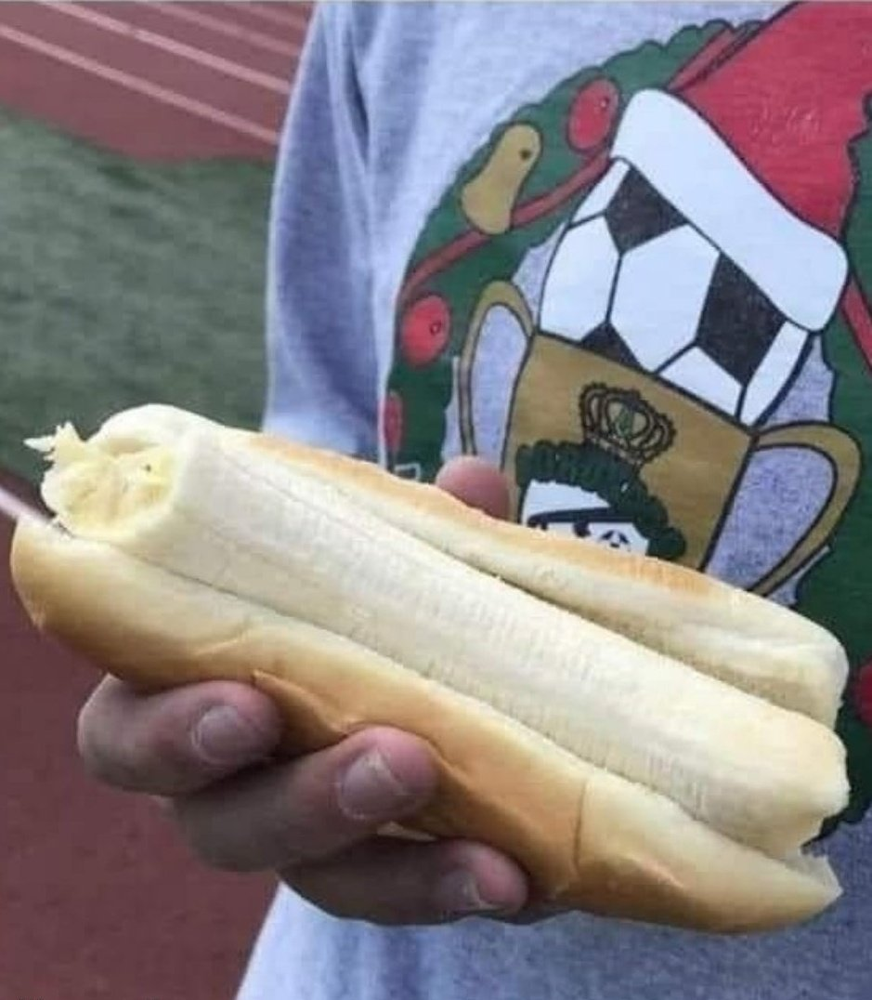

CS184 Project 3-1: Pathtracer
==============

***Due: March 15, 2022***

**Author:** *Albert Wen*

Lol starting late lol life is a mess lol smh

# Part 1: Ray Generation and Scene Intersection

* Walk through the ray generation and primitive intersection parts of the rendering pipeline.
* Explain the triangle intersection algorithm you implemented in your own words.
* Show images with normal shading for a few small .dae files.

# Part 2: Bounding Volume Hierarchy
* Walk through your BVH construction algorithm. Explain the heuristic you chose for picking the splitting point.
* Show images with normal shading for a few large .dae files that you can only render with BVH acceleration.
* Compare rendering times on a few scenes with moderately complex geometries with and without BVH acceleration. Present your results in a one-paragraph analysis.

# Part 3: Direct Illumination
* Walk through both implementations of the direct lighting function.
Show some images rendered with both implementations of the direct lighting function.
* Focus on one particular scene with at least one area light and compare the noise levels in soft shadows when rendering with 1, 4, 16, and 64 light rays (the -l flag) and with 1 sample per pixel (the -s flag) using light sampling, not uniform hemisphere sampling.
* Compare the results between uniform hemisphere sampling and lighting sampling in a one-paragraph analysis.

# Part 4: Global Illumination
* Walk through your implementation of the indirect lighting function.
Show some images rendered with global (direct and indirect) illumination. Use 1024 samples per pixel.
* Pick one scene and compare rendered views first with only direct illumination, then only indirect illumination. Use 1024 samples per pixel. (You will have to edit PathTracer::at_least_one_bounce_radiance(...) in your code to generate these views.)
* For CBbunny.dae, compare rendered views with max_ray_depth set to 0, 1, 2, 3, and 100 (the -m flag). Use 1024 samples per pixel.
* Pick one scene and compare rendered views with various sample-per-pixel rates, including at least 1, 2, 4, 8, 16, 64, and 1024. Use 4 light rays.
You will probably want to use the instructional machines for the above renders in order to not burn up your own computer for hours.
# Part 5: Adaptive Sampling
* Walk through your implementation of the adaptive sampling.
* Pick one scene and render it with at least 2048 samples per pixel. Show a good sampling rate image with clearly visible differences in sampling rate over various regions and pixels. Include both your sample rate image, which shows your how your adaptive sampling changes depending on which part of the image you are rendering, and your noise-free rendered result. Use 1 sample per light and at least 5 for max ray depth.

# Web Page
[It's on GitHub](https://github.com/cal-cs184-student/sp22-project-webpages-AlbertScribblenaut/blob/master/proj3-1/index.md)
