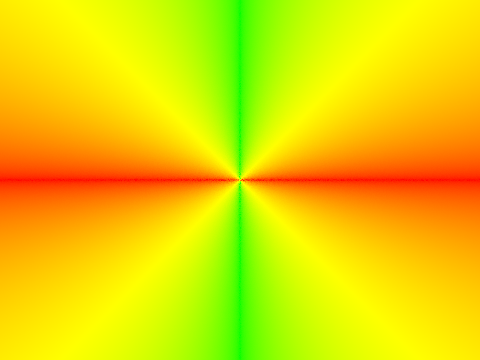

CS184 Project 3-1: Pathtracer
==============

***Due: March 15, 2022***

**Author:** *Albert Wen*

Lol starting late lol life is a mess lol smh

# Part 1: Ray Generation and Scene Intersection

* Walk through the ray generation and primitive intersection parts of the rendering pipeline.
* Explain the triangle intersection algorithm you implemented in your own words.

Ray generation and primitive intersection implementation involved writing code in `camera.cpp`, `triangle.cpp`, and `spheres.cpp`. In order to perform ray tracing on a setting and render the results within a virtual camera, I performed the following steps to generate the rays:
* Perform a mapping between the point of ray intersection on the plane of an image sensor to the camera coordinates then world coordinates.
* Generate a `ray` object with the `Vector3D` positions of the camera's `pos` and ray intersection on the plane of the original image.
The correct implementation of `camera.cpp` results in the images below.

Next came the raytracing of primitives in 3D space. Two primitives were used for this implementation: triangles and spheres. Determining the point of intersection between a triangle and ray emitted from the camera required implementing the Moller Trumbore algorithm, which establishes a linear system of equations for generating barycentric coordinates of a point in a triangle and the time of intersection from the ray's origin. The solutions to this system of equations determine the time of intersection of the ray with the plane in which the triangle lies and if the intersection lies within the triangle itself. The time of intersection, point of intersection, normal unit vector of the point of intersection, and the triangle's BSDF are then stored in an `Intersection` object for rendering. One critical check that was performed was to see if the time of intersection fell between the `ray` object's `min_t` and `max_t` in order to be valid, as the `ray` is not intended to continue infinitely.

> `bool Triangle::intersect(const Ray &r, Intersection *isect) const {
  // Part 1, Task 3:
  // implement ray-triangle intersection. When an intersection takes
  // place, the Intersection data should be updated accordingly
	Vector3D E1 = p2 - p1;
	Vector3D E2 = p3 - p1;
	Vector3D S = r.o - p1;
	Vector3D S1 = cross(r.d, E2);
	Vector3D S2 = cross(S, E1);

	>float t = dot(S2, E2) / dot(S1, E1);
	if (has_intersection(r)) {
		isect->t = t;
		Vector3D intPt = r.at_time(t);
		float b1 = dot(S1, S) / dot(S1, E1);
		float b2 = dot(S2, r.d) / dot(S1, E1);
		Vector3D nIntPt = (1 - b1 - b2) * n1 + b1 * n2 + b2 * n3;
		isect->n = nIntPt;
		isect->primitive = this;
		isect->bsdf = get_bsdf();
	}
	return has_intersection(r);`
* Code snippet from `Triangle::intersect` in `triangle.cpp`

# Part 2: Bounding Volume Hierarchy
* Walk through your BVH construction algorithm. Explain the heuristic you chose for picking the splitting point.
* Show images with normal shading for a few large .dae files that you can only render with BVH acceleration.
* Compare rendering times on a few scenes with moderately complex geometries with and without BVH acceleration. Present your results in a one-paragraph analysis.

# Part 3: Direct Illumination
* Walk through both implementations of the direct lighting function.
Show some images rendered with both implementations of the direct lighting function.
* Focus on one particular scene with at least one area light and compare the noise levels in soft shadows when rendering with 1, 4, 16, and 64 light rays (the -l flag) and with 1 sample per pixel (the -s flag) using light sampling, not uniform hemisphere sampling.
* Compare the results between uniform hemisphere sampling and lighting sampling in a one-paragraph analysis.

# Part 4: Global Illumination
* Walk through your implementation of the indirect lighting function.
Show some images rendered with global (direct and indirect) illumination. Use 1024 samples per pixel.
* Pick one scene and compare rendered views first with only direct illumination, then only indirect illumination. Use 1024 samples per pixel. (You will have to edit PathTracer::at_least_one_bounce_radiance(...) in your code to generate these views.)
* For CBbunny.dae, compare rendered views with max_ray_depth set to 0, 1, 2, 3, and 100 (the -m flag). Use 1024 samples per pixel.
* Pick one scene and compare rendered views with various sample-per-pixel rates, including at least 1, 2, 4, 8, 16, 64, and 1024. Use 4 light rays.
You will probably want to use the instructional machines for the above renders in order to not burn up your own computer for hours.
# Part 5: Adaptive Sampling
* Walk through your implementation of the adaptive sampling.
* Pick one scene and render it with at least 2048 samples per pixel. Show a good sampling rate image with clearly visible differences in sampling rate over various regions and pixels. Include both your sample rate image, which shows your how your adaptive sampling changes depending on which part of the image you are rendering, and your noise-free rendered result. Use 1 sample per light and at least 5 for max ray depth.

# Web Page
[Written in Markdown, hosted on GitHub](https://github.com/cal-cs184-student/sp22-project-webpages-AlbertScribblenaut/blob/master/proj3-1/index.md)
