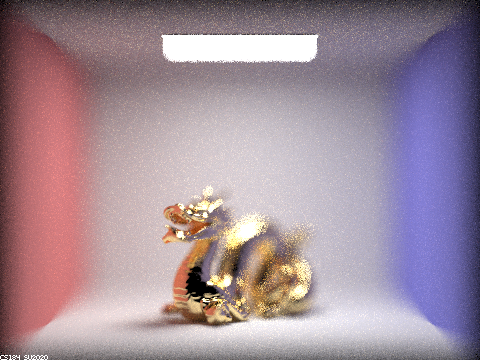
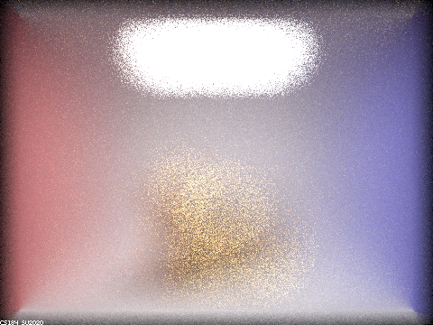

CS184 Project 3-2: Pathtracer
==============

***Due: April 1, 2022***

**Author:** *Albert Wen*

# Part 1

## Ray depth 0

Figure 1: *CBspheres.dae with ray depth 0*

In Figure 1, when ray depth is 0, neither of the spheres is visible. As a result of direct illumination, only the light from the ceiling is visible to the camera. The zeroth bounce from the ceiling makes it visible to the camera, but the ceiling is completely dark.

## Ray depth 1
Figure 2: *CBspheres.dae with ray depth 1*

In Figure 2, the box surrounding the spheres and their outlines are visible. Both spheres exhibit a white highlight because they reflect the direct illumination from the ceiling only. With only one bounce, the rays cannot allow the material to reflect the colors of the adjacent walls of the box. Shadows are accurately depicted due to the `at_least_one_bounce_radiance` function.

## Ray depth 2

Figure 3: *CBspheres.dae with ray depth 2*

Figure 3 accurately shows reflection, especially as seen in the left sphere. The two-bounce rays that show the reflected images of the space and right sphere follow the following sequence before ending at the camera's sensor:
* Zeroth bounce: exiting from the ceiling light for direct illumination
* First bounce: reflecting off the box space or the right sphere's surface
* Second bounce: reflecting off the left sphere

In the right sphere, there is some reflection exhibited, but it is not a purely reflective material. It refracts somewhat, but it absorbs almost all refracting rays because rays with at least depth 3 are required.

This image is also the first where the ceiling panel's color is now visible to the camera, but not visible in the left sphere's reflection of the environment.

## Ray depth 3

Figure 4: *CBspheres.dae with ray depth 3*

As seen in Figure 4, the right sphere now refracts light because rays that undergo refraction can enter and exit the sphere's material. Compared to the previous figure, the reflections shown in the right sphere are no longer visible due to the refracting light. Three-bounce rays that refract through the right sphere undergo either of the following sequence before terminating at the camera's sensor:

**Sequence 1**

1. Zeroth bounce: exiting from the ceiling light for direct illumination
2. First bounce: reflecting off the box space or the left sphere's surface
3. Second bounce: refracting upon entry, from air to the right sphere's glass
4. Third bounce: refracting upon exit, from glass to air

**Sequence 2**

1. Zeroth bounce: exiting from the ceiling light for direct illumination
2. First bounce: refracting upon entry, from air to the right sphere's glass
3. Second bounce: refracting upon exit, from glass to air
4. Third bounce: reflecting off the floor

Following the second sequence of bounces contributes to the highlight on the floor directly beneath the right sphere.

The left sphere's reflection of the right sphere's image appears black because there were not enough bounces available for it to properly display the right sphere's image. This time, the ceiling panel's reflection is accurately captured.

## Ray depth 4

Figure 5: *CBspheres.dae with ray depth 4*

With an additional bounce, Figure 5 also displays additional refraction from the right sphere and properly reflects refracted rays exiting the right sphere to the camera. Furthermore, there is now a small circle of light in the lower right corner of the image, resulting from both total internal reflection occurring between the bounce entering and the bounce exiting the right sphere and reflections from the floor to the wall.

The ceiling panel reflected in the left sphere is brighter than before.

## Ray depth 5

Figure 6: *CBspheres.dae with ray depth 5*

The highlight in the lower right is larger than before due to more contributing rays exiting the right sphere's material.

The ceiling panel reflected in the left sphere is brighter than before too.

## Ray depth 100

Figure 7: *CBspheres.dae with ray depth 100*

There is no obvious difference between Figures 6 and 7.

# Part 4

A thin-lens camera model uses a thin lens to refract incoming rays from the image plane to a plane of focus. Rays that do not pass through the center of the lens are refracted but still intersect at the same point of focus as the ray that passes through the lens' center. As a result, points surrounding the point of focus are out of focus. A pinhole camera model idealizes the aforementioned thin-lens camera model by approximating the aperture or lens radius to 0, effectively allowing rays from the image plane to reach the view plane without any refraction in between the planes. There is no resulting distortion from the image when viewed through a pinhole camera model.

Figure 8: *CBdragon.dae with aperture 1.23, depth 4.56*

## Focus stack with aperture change, depth at 4.56

Figure 9: *CBdragon.dae with aperture 0.25, depth 4.56*

Figure 10: *CBdragon.dae with aperture 0.5, depth 4.56*

Figure 11: *CBdragon.dae with aperture 0.75, depth 4.56*

Figure 12: *CBdragon.dae with aperture 1, depth 4.56*

## Focus stack with depth change, aperture at 1.23

Figure 13: *CBdragon.dae with aperture 1.23, depth 1*

Figure 14: *CBdragon.dae with aperture 1.23, depth 2*

Figure 15: *CBdragon.dae with aperture 1.23, depth 3*

Figure 16: *CBdragon.dae with aperture 1.23, depth 4*

# Web Page
[Written in Markdown, hosted on GitHub](https://github.com/cal-cs184-student/sp22-project-webpages-AlbertScribblenaut/edit/master/proj3-2/index.md)
