CS184 Project 3-2: Pathtracer
==============

***Due: April 1, 2022***

**Author:** *Albert Wen*

This project is an extension of Project 3-1. The previous project developed fundamentals of ray tracing and illumination, while this one focused on material modeling, environment modeling, and camera lenses. I chose to complete Parts 1 and 4, which models glass and mirror materials and the depth of field of a thin-lens camera respectively. The staff library instead of my Project 3-1 code was used to complete this project.

# Part 1

For simplification, the object coordinate space was used to assist in bidrectional scattering distribution function (BSDF) calculations.

Mirrors are assumed to have perfect specular reflections, therefore implementation was very straightforward. In the `BSDF::reflect()` function, which took in a `Ray wo` and `Ray* wi`, I reflected `wo` about a normal vector `Vector3D(0, 0, 1)` and assigned the reflected `Ray` to `*wi`.

```
void BSDF::reflect(const Vector3D wo, Vector3D* wi) {
    *wi = dot(Vector3D(0,0,1), wo) * Vector3D(0, 0, 1) * 2 - wo;
}
```
*Code snippet from `BSDF::reflect()` in `advanced_bsdf.cpp`*

Rays that were refracted were redirected in accordance with Snell's Law. The term `eta` used the medium of interest's index of refraction and was dependent on whether the ray was entering or exiting into another medium. Total internal reflection was also accounted for within the loop.
```
bool BSDF::refract(const Vector3D wo, Vector3D* wi, double ior) {
    double eta = ior;
    if (wo.z > 0) {
        // entering surface
        eta = 1. / ior;
        if ((1. - pow(eta, 2) * (1. - pow(cos_theta(wo), 2))) < 0) {
            return false;
        }
    }
    wi->x = -eta * wo.x;
    wi->y = -eta * wo.y;
    wi->z = sqrt(1 - pow(eta, 2) * (1. - pow(wo.z, 2)));
    if (wo.z > 0) {
        wi->z = -wi->z;
    }
	return true;
}
```
*Code snippet from `BSDF::refract()` in `advanced_bsdf.cpp`*

To fully encapsulate specular interactions with glass, I utilized both the code for reflections and Schlick's approximation to the Fresnel equations. Using `coin_flip` probability for the Schlick coefficient `R`, I was able to approximate the behavior of specular reflection and refraction inside the glass sphere of `CBspheres.dae`.

```
Vector3D GlassBSDF::sample_f(const Vector3D wo, Vector3D* wi, double* pdf) {
    double eta = ior;
    if (wo.z > 0) {
        eta = 1. / ior;
    }

    if ((1. - pow(eta, 2) * (1. - pow(cos_theta(wo), 2))) < 0) {
        reflect(wo, wi);
        *pdf = 1;
        return reflectance / abs_cos_theta(*wi);
    }
    else {
        double n1 = 1;  // ior of air
        double n2 = ior;
        double R0 = pow((n1 - n2) / (n1 + n2), 2);
        double R = R0 + (1 - R0) * pow(1 - abs_cos_theta(wo), 5);
        if (coin_flip(R)) {
            reflect(wo, wi);
            *pdf = R;
            return R * reflectance / abs_cos_theta(*wi);
        }
        else {
            refract(wo, wi, ior);
            *pdf = 1 - R;
            return (1 - R) * transmittance / abs_cos_theta(*wi) / pow(eta, 2);
        }
    }
}
```
*Code snippet from `GlassBSDF::sample_f()` in `advanced_bsdf.cpp`*

## Ray depth 0
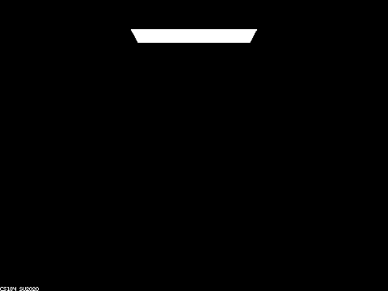

Figure 1: *CBspheres.dae with ray depth 0*

In Figure 1, when ray depth is 0, neither of the spheres is visible. As a result of direct illumination, only the light from the ceiling is visible to the camera. The zeroth bounce from the ceiling makes it visible to the camera, but the ceiling is completely dark.

## Ray depth 1
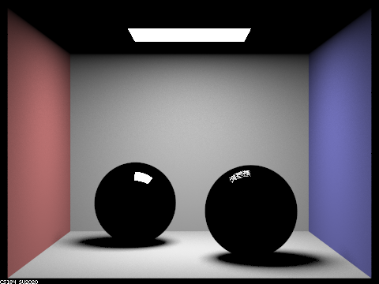

Figure 2: *CBspheres.dae with ray depth 1*

In Figure 2, the box surrounding the spheres and their outlines are visible. Both spheres exhibit a white highlight because they reflect the direct illumination from the ceiling only. With only one bounce, the rays cannot allow the material to reflect the colors of the adjacent walls of the box. Shadows are accurately depicted due to the `at_least_one_bounce_radiance` function.

## Ray depth 2
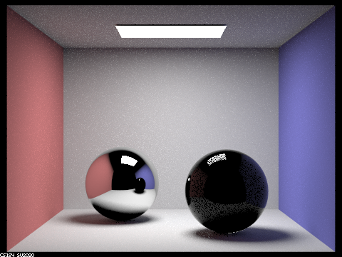

Figure 3: *CBspheres.dae with ray depth 2*

Figure 3 accurately shows reflection, especially as seen in the left sphere. The two-bounce rays that show the reflected images of the space and right sphere follow the following sequence before ending at the camera's sensor:
* Zeroth bounce: exiting from the ceiling light for direct illumination
* First bounce: reflecting off the box space or the right sphere's surface
* Second bounce: reflecting off the left sphere

In the right sphere, there is some reflection exhibited, but it is not a purely reflective material. It refracts somewhat, but it absorbs almost all refracting rays because rays with at least depth 3 are required. In other words, the glass sphere allows rays to enter the glass medium, but those that do cannot exit from glass to air.

This image is also the first where the ceiling panel's color is now visible to the camera, but not visible in the left sphere's reflection of the environment.

## Ray depth 3
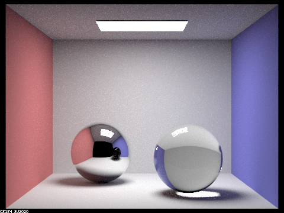

Figure 4: *CBspheres.dae with ray depth 3*

As seen in Figure 4, the right sphere now refracts light because rays that undergo refraction can enter and exit the sphere's material. Compared to the previous figure, most of the reflections shown in the right sphere are no longer visible due to the refracting light. The right sphere does have a reflected image of the left sphere, but it is not obvious. Three-bounce rays that refract through the right sphere undergo either of the following sequence before terminating at the camera's sensor:

**Sequence 1**

1. Zeroth bounce: exiting from the ceiling light for direct illumination
2. First bounce: reflecting off the box space or the left sphere's surface
3. Second bounce: refracting upon entry, from air to the right sphere's glass
4. Third bounce: refracting upon exit, from glass to air

**Sequence 2**

1. Zeroth bounce: exiting from the ceiling light for direct illumination
2. First bounce: refracting upon entry, from air to the right sphere's glass
3. Second bounce: refracting upon exit, from glass to air
4. Third bounce: reflecting off the floor

Following the second sequence of bounces contributes to the highlight on the floor directly beneath the right sphere.

The left sphere's reflection of the right sphere's image appears black because there were not enough bounces available for it to properly display the right sphere's image. This time, the ceiling panel's reflection is accurately captured.

## Ray depth 4
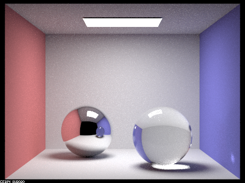

Figure 5: *CBspheres.dae with ray depth 4*

With an additional bounce, Figure 5 also displays additional refraction from the right sphere and properly reflects refracted rays exiting the right sphere to the camera. Furthermore, there is now a small circle of light in the lower right corner of the image, resulting from both total internal reflection occurring between the bounce entering and the bounce exiting the right sphere and reflections from the floor to the wall.

The ceiling panel reflected in the left sphere is brighter than before.

## Ray depth 5
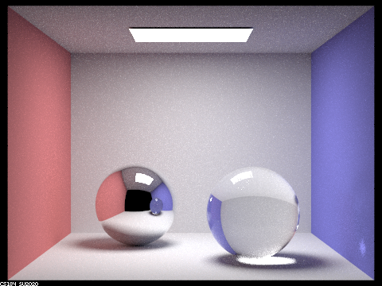

Figure 6: *CBspheres.dae with ray depth 5*

The highlight in the lower right is larger than before due to more contributing rays exiting the right sphere's material.

The ceiling panel reflected in the left sphere is brighter than before too.

## Ray depth 100
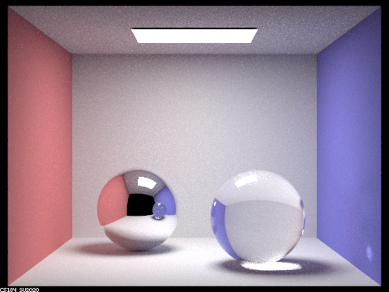

Figure 7: *CBspheres.dae with ray depth 100*

There is no obvious difference between Figures 6 and 7.

# Part 4

A thin-lens camera model uses a thin lens to refract incoming rays from the image plane to a plane of focus. Rays that do not pass through the center of the lens are refracted but still intersect at the same point of focus as the ray that passes through the lens' center. As a result, points surrounding the point of focus are out of focus. A pinhole camera model idealizes the aforementioned thin-lens camera model by approximating the aperture or lens radius to 0, effectively allowing rays from the image plane to reach the view plane without any refraction in between the planes. There is no resulting distortion from the image when viewed through a pinhole camera model.

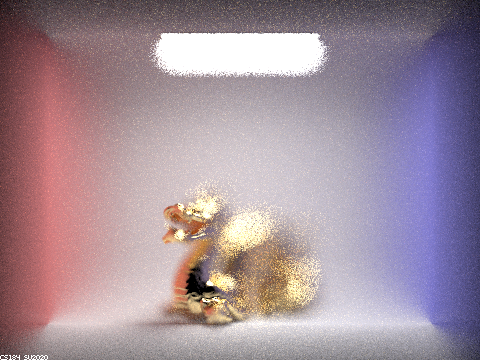

Figure 8: *CBdragon.dae with aperture 1.23, depth 4.56*

As shown in Figure 8, the rendered dragon appears to have only the chest and mouth in focus. The edges of the box are noticeably blurred, and there is appears to be an in-focus rectangular outline around the dragon. This image was made possible with the following algorithm:
* Determine a ray `Ray redRay` from the image plane to the center of the thin lenses by translating from normalized image coordinates to camera coordinates
* Find a point `Vector3D pFocus` that intersects between the plane of focus and the above ray
* Uniformly sample a point on the thin lens with `Vector3D pLens = (lensRadius * sqrt(rndR) * cos(rndTheta), lensRadius * sqrt(rndR) * sin(rndTheta), 0)`, where `rndR` and `rndTheta` are random variables `0 <= rndR < 1` and `0 <= rndTheta < 2 * PI`.
* Determine the direction `Vector3D blueDir` of the ray from `pLens` to `pFocus`
* Normalize `blueDir`
* Perform a transform from camera space to world space for `blueDir` and `pLens` with the `Matrix3x3 c2w` matrix
* adjust the position of `pLens` with `pos`, which denotes the lens' center within world space
* construct the `Ray blueRay` object with the adjusted `pLens` as the origin and `blueDir` as the direction and set the near and far clips of the `Ray`
* return `blueRay`


## Focus stack with aperture change, depth at 4.56

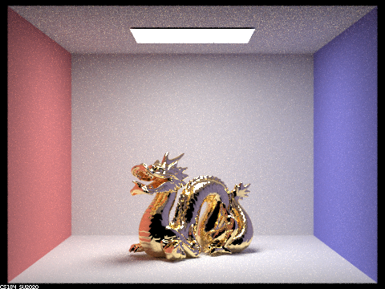

Figure 9: *CBdragon.dae with aperture 0.02, depth 4.56*

In Figure 9, the image appears to be mostly in focus, even with a nonzero lens radius.

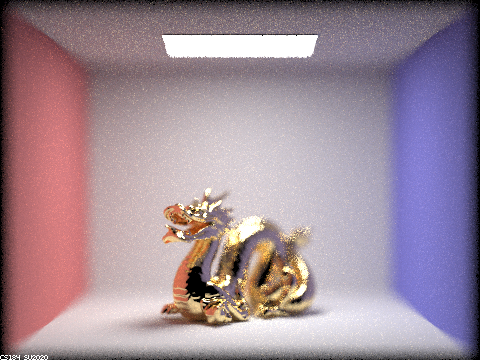

Figure 10: *CBdragon.dae with aperture 0.25, depth 4.56*

In Figure 10, there is more blurring around the dragon's body and the box's edges appear less sharp than in Figure 9.

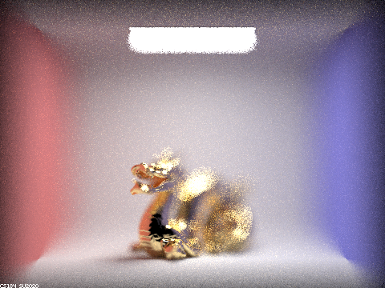

Figure 11: *CBdragon.dae with aperture 0.75, depth 4.56*

The box's edges have completely blurred together in Figure 13.

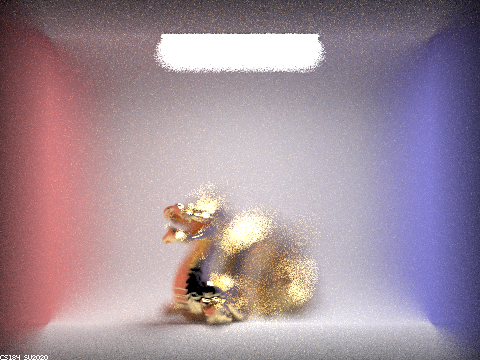

Figure 12: *CBdragon.dae with aperture 2, depth 4.56*

The dragon's chest and mouth are the only well-defined features in Figure 12.

## Focus stack with depth change, aperture at 1.23

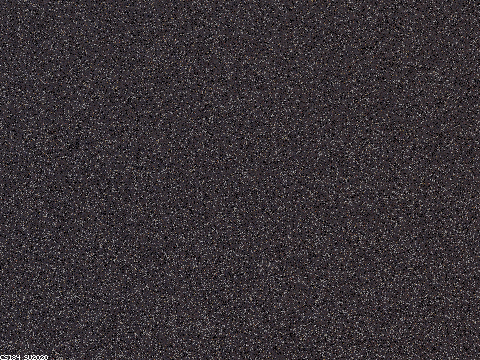

Figure 13: *CBdragon.dae with aperture 1.23, depth 1*

There is no visible image of the dragon in Figure 13 because there aren't enough rays refracting to the point of focus on the plane of focus.

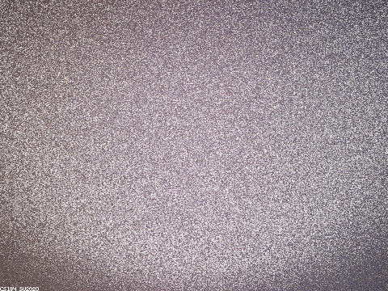

Figure 14: *CBdragon.dae with aperture 1.23, depth 2*

Figure 14 shows noticeable improvements in visibility, but no distinct colors. It looks like the depth is too low and results several refracted rays from reaching the point of focus.

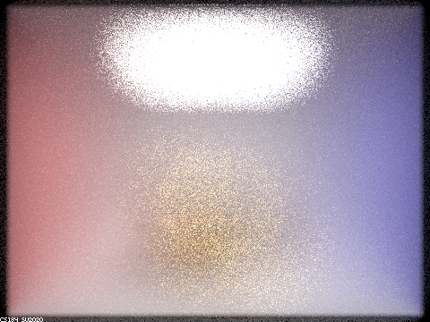

Figure 15: *CBdragon.dae with aperture 1.23, depth 3*

There are now visibly distinct colors in Figure 15, but no distinct features from the dragon.

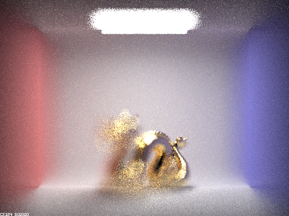

Figure 16: *CBdragon.dae with aperture 1.23, depth 5*

Because the depth is greater than shown in previous figures, the midsection of the dragon is now visible in Figure 16. The chest and mouth of the dragon are no longer in focus.


# Web Page
[Written in Markdown, hosted on GitHub](https://github.com/cal-cs184-student/sp22-project-webpages-AlbertScribblenaut/edit/master/proj3-2/index.md)
