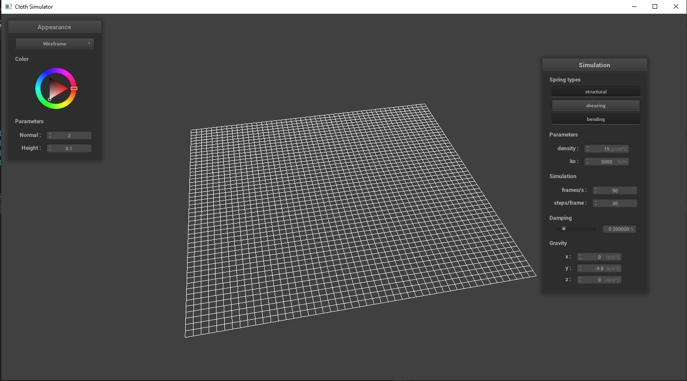

CS184 Project 4: ClothSim
==============

***Due: April 12, 2022***

Wow haha isn't that a coincidence that the day this assignment is due is also the day I lost my dog a year ago. I remember already being in a mess then, but at least it's not as bad as it is now. It's still pretty bad.

**Author:** *Albert Wen*

# Overview

This project focused on creating a physics-based recreation of a square cloth folding and falling over itself. Given a `.json` file in the `scene` folder, I set out to create a grid of point masses and springs to approximate a cloth material and implemented a simulation via numerical integration. I repeatedly ran into issues with creating evenly spaced apart point masses in the simulation. The biggest obstacle at this point is getting the simulation to run faster.

# Part 1: Masses and springs

Figure 1 displays `pin2.json` with no shearing constraints. The removal of said constraints leads the simulator to not display any diagonal springs. I ran into indexing issues with determining which springs should receive what, especially for `BENDING` constraints.

Figure 2 displays `pin2.json` with only shearing constraints. This shows exclusively diagonal springs.

Figure 3 displays `pin2.json` with all constraints. This includes diagonal, horizontal and vertical springs.

# Part 2: Simulation via numerical integration

I was hoping to include changes based on extreme values of `ks` and variable `density` and `damping`. There may be issues with grid construction from the previous part because the colors in with the Normal shaders don't match up with mine. It's not possible to view any obvious changes because the simulation itself moves too slowly.

Figure 4 is all I am able to produce for this part. I'm not sure if this is really the intended resting position.

# Part 3: Handling collisions with other objects

# Part 4: Handling self-collisions

# Part 5: Shaders

# Web Page
[Written in Markdown, hosted on GitHub](https://github.com/cal-cs184-student/sp22-project-webpages-AlbertScribblenaut/blob/master/proj4/index.md)
https://github.com/cal-cs184-student/sp22-project-webpages-AlbertScribblenaut/blob/master/proj4/index.md
